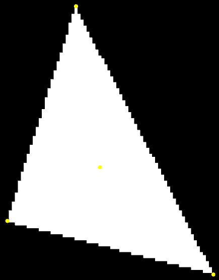
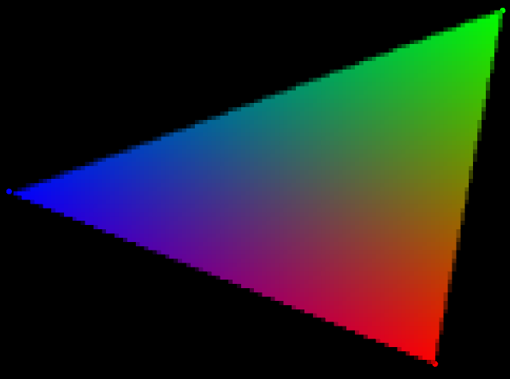

# Taller raster

## Propósito

Comprender algunos aspectos fundamentales del paradigma de rasterización.

## Tareas

Emplee coordenadas baricéntricas para:

1. Rasterizar un triángulo;
2. Implementar un algoritmo de anti-aliasing para sus aristas; y,
3. Hacer shading sobre su superficie.

Implemente la función ```triangleRaster()``` del sketch adjunto para tal efecto, requiere la librería [frames](https://github.com/VisualComputing/framesjs/releases).

## Integrantes

Máximo 3.

Complete la tabla:

| Integrante | github nick |
|------------|-------------|
| Juan Nicolás Sastoque Espinosa | [NicolasZon](https://github.com/NicolasZon/) |
| Liseth Briceño Albarracín | [ligibrial](https://github.com/ligibrial/) | 

## Discusión

Describa los resultados obtenidos. Qué técnicas de anti-aliasing y shading se exploraron? Adjunte las referencias. Discuta las dificultades encontradas.

Para decidir si un punto se encontraba dentro del interior del triangulo fue necesario implementar la formula para calcular la orientación de los vértices, este calculo corresponde a:
(A1.x - A3.x) * (A2.y - A3.y) - (A1.y - A3.y) * (A2.x - A3.x)

Dado lo anterior si era mayor que 0 tenia una orientación positiva, en caso contrario la orientación era negativa.

Lo cual generó las siguientes imágenes con anti-aliasing y sin anti-aliasing:
- 
- 
 
Para realizar la técnica de anti-aliasing se tuvo en cuenta que se subdividió cada uno de los pixeles (puntos) en zonas mas pequeñas, y a su vez se analizó que cada región tenía su respectivo color, para ello se utilizó la tecnica de subsampling, y en cuanto la técnica de shading (coordenadas báricentricas)se exploró el color correspondiente  de cada uno de los puntos del triangulo en RGB, dado esto  se observa que cada punto dentro dentro triangulo corresponde a una intesidad de color distinto.

Referencias consultadas:

* https://www.youtube.com/watch?v=7uGlMA3FV1E
* http://www.dma.fi.upm.es/personal/mabellanas/tfcs/kirkpatrick/Aplicacion/algoritmos.htm#puntoInteriorAlgoritmo
* https://fgiesen.wordpress.com/2013/02/08/triangle-rasterization-in-practice/
* https://fgiesen.wordpress.com/2013/02/06/the-barycentric-conspirac/

Algunas de las dificultades encontradas fue la ubicación de un punto dentro de un triángulo, para ello fue necesario entender la explicación de las  coordenas baricéntricas para así mismo calcular la orientación del triangulo y saber si en este  caso era positivo o  negativo.

## Entrega

* Modo de entrega: [Fork](https://help.github.com/articles/fork-a-repo/) la plantilla en las cuentas de los integrantes (de las que se tomará una al azar).
* Plazo: 1/4/18 a las 24h.
